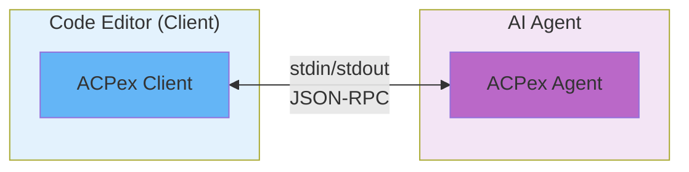
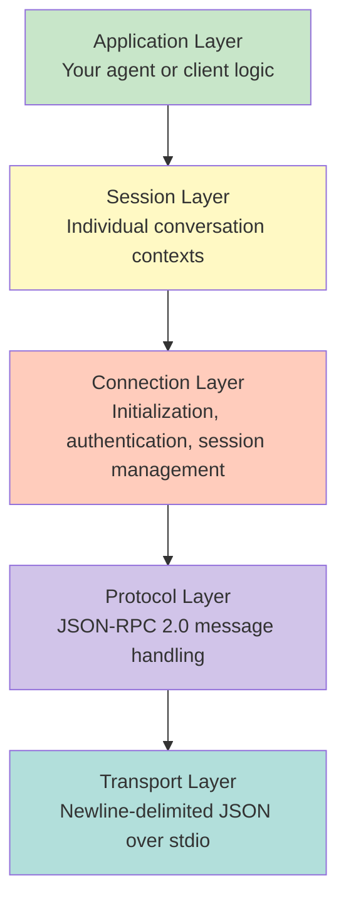
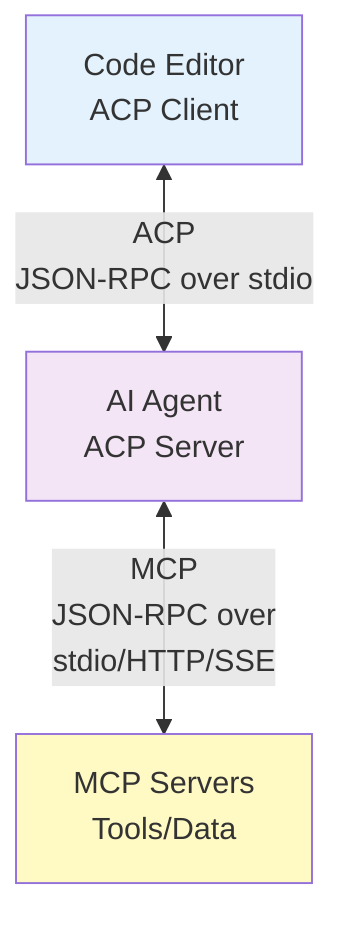
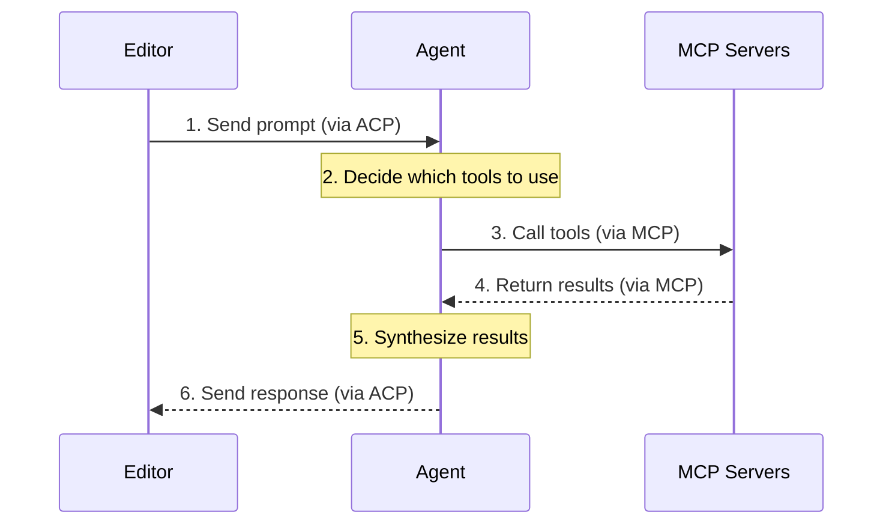
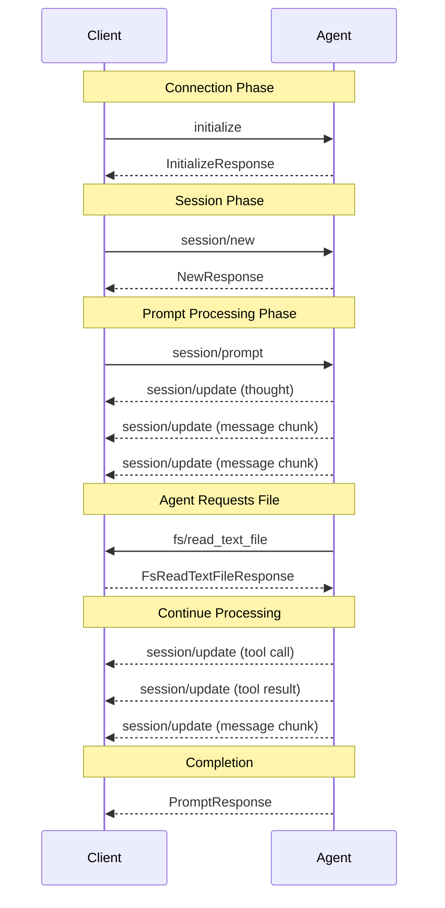

# Agent Client Protocol Overview

This guide provides a comprehensive overview of the Agent Client Protocol (ACP)
and how it's implemented in ACPex.

## Table of Contents

- [What is ACP?](#what-is-acp)
- [Protocol Architecture](#protocol-architecture)
- [Message Format](#message-format)
- [Connection Lifecycle](#connection-lifecycle)
- [Session Lifecycle](#session-lifecycle)
- [Message Types](#message-types)
- [Capabilities](#capabilities)
- [Error Handling](#error-handling)
- [Relationship to MCP](#relationship-to-mcp)

## What is ACP?

The **Agent Client Protocol (ACP)** is a JSON-RPC 2.0 based protocol that
standardizes communication between code editors (clients) and AI coding agents.
It's similar in spirit to the Language Server Protocol (LSP), but specifically
designed for AI-powered coding assistance.

### Key Design Principles

1. **Bidirectional** - Both client and agent can send requests to each other
2. **Streaming** - Agents send real-time updates during processing
3. **Stateful** - Sessions maintain conversation history
4. **Standard I/O** - Uses stdin/stdout for simple subprocess communication
5. **JSON-RPC 2.0** - Proven protocol for request/response patterns

### ACP vs Other Protocols

**Not to be confused with:**

- **Agent Communication Protocol (IBM/BeeAI)** - REST-based protocol for
  inter-agent communication
- **Model Context Protocol (MCP)** - Protocol for connecting AI models to tools
  and data sources
- **Agent-to-Agent (A2A)** - Protocol for autonomous agent collaboration

**ACP is specifically for editor ↔ agent communication.**

## Protocol Architecture

### Components



### Layer Stack



## Message Format

All messages follow JSON-RPC 2.0 specification:

### Requests

Messages that expect a response:

```json
{
  "jsonrpc": "2.0",
  "id": 1,
  "method": "initialize",
  "params": {
    "protocolVersion": 1,
    "capabilities": {}
  }
}
```

### Responses

Replies to requests:

```json
{
  "jsonrpc": "2.0",
  "id": 1,
  "result": {
    "protocolVersion": 1,
    "agentCapabilities": {}
  }
}
```

### Errors

Error responses:

```json
{
  "jsonrpc": "2.0",
  "id": 1,
  "error": {
    "code": -32001,
    "message": "Authentication failed"
  }
}
```

### Notifications

One-way messages (no response expected):

```json
{
  "jsonrpc": "2.0",
  "method": "session/update",
  "params": {
    "sessionId": "abc123",
    "update": {
      "kind": "message",
      "content": "Hello"
    }
  }
}
```

## Connection Lifecycle

### Phase 1: Initialization

**Client → Agent: `initialize`**

```json
{
  "method": "initialize",
  "params": {
    "protocolVersion": 1,
    "clientInfo": {
      "name": "My Editor",
      "version": "1.0.0"
    },
    "capabilities": {
      "fileSystem": {
        "readTextFile": true,
        "writeTextFile": true
      },
      "terminal": {
        "create": true
      }
    },
    "authenticationMethods": []
  }
}
```

**Agent → Client: `InitializeResponse`**

```json
{
  "result": {
    "protocolVersion": 1,
    "agentCapabilities": {
      "sessions": {
        "new": true,
        "load": false
      }
    },
    "meta": {
      "name": "AI Agent",
      "version": "2.0.0"
    },
    "authenticationMethods": []
  }
}
```

### Phase 2: Authentication (Optional)

**Client → Agent: `authenticate`**

```json
{
  "method": "authenticate",
  "params": {
    "methodId": "api_key",
    "data": {
      "apiKey": "sk-..."
    }
  }
}
```

**Agent → Client: `AuthenticateResponse`**

```json
{
  "result": {}
}
```

Or error:

```json
{
  "error": {
    "code": -32001,
    "message": "Invalid API key"
  }
}
```

### Phase 3: Ready for Sessions

Connection is now ready. Client can create sessions.

## Session Lifecycle

### Creating a Session

**Client → Agent: `session/new`**

```json
{
  "method": "session/new",
  "params": {
    "cwd": "/home/user/project",
    "mcpServers": []
  }
}
```

**Agent → Client: `NewResponse`**

```json
{
  "result": {
    "sessionId": "session_12345"
  }
}
```

### Sending a Prompt

**Client → Agent: `session/prompt`**

```json
{
  "method": "session/prompt",
  "params": {
    "sessionId": "session_12345",
    "content": [
      {
        "type": "text",
        "text": "Refactor this function"
      },
      {
        "type": "resource",
        "uri": "file:///src/main.ex",
        "mimeType": "text/x-elixir"
      }
    ]
  }
}
```

### Streaming Updates

**Agent → Client: `session/update` (notification)**

The agent sends multiple update notifications:

```json
{
  "method": "session/update",
  "params": {
    "sessionId": "session_12345",
    "update": {
      "kind": "agent_thought_chunk",
      "content": {
        "thought": "I need to analyze the function first..."
      }
    }
  }
}
```

```json
{
  "method": "session/update",
  "params": {
    "sessionId": "session_12345",
    "update": {
      "kind": "agent_message_chunk",
      "content": {
        "role": "assistant",
        "content": [
          {
            "type": "text",
            "text": "I'll refactor this function by..."
          }
        ]
      }
    }
  }
}
```

### Final Response

**Agent → Client: `PromptResponse`**

```json
{
  "result": {
    "content": [
      {
        "type": "text",
        "text": "Refactoring complete!"
      }
    ],
    "stopReason": "done"
  }
}
```

### Cancellation

**Client → Agent: `session/cancel` (notification)**

```json
{
  "method": "session/cancel",
  "params": {
    "sessionId": "session_12345"
  }
}
```

The agent should stop processing and return a response with
`stopReason: "cancelled"`.

## Message Types

### Connection-Level Messages

| Method         | Direction      | Type    | Purpose                |
| -------------- | -------------- | ------- | ---------------------- |
| `initialize`   | Client → Agent | Request | Capability negotiation |
| `authenticate` | Client → Agent | Request | Authentication         |

### Session-Level Messages

| Method           | Direction      | Type         | Purpose               |
| ---------------- | -------------- | ------------ | --------------------- |
| `session/new`    | Client → Agent | Request      | Create new session    |
| `session/load`   | Client → Agent | Request      | Load previous session |
| `session/prompt` | Client → Agent | Request      | Send user prompt      |
| `session/update` | Agent → Client | Notification | Streaming updates     |
| `session/cancel` | Client → Agent | Notification | Cancel processing     |

### Client Request Messages (Agent → Client)

| Method                   | Direction      | Type    | Purpose                    |
| ------------------------ | -------------- | ------- | -------------------------- |
| `fs/read_text_file`      | Agent → Client | Request | Read file content          |
| `fs/write_text_file`     | Agent → Client | Request | Write file content         |
| `terminal/create`        | Agent → Client | Request | Create terminal            |
| `terminal/output`        | Agent → Client | Request | Get terminal output        |
| `terminal/wait_for_exit` | Agent → Client | Request | Wait for command to finish |
| `terminal/kill`          | Agent → Client | Request | Kill running command       |
| `terminal/release`       | Agent → Client | Request | Release terminal resources |

## Capabilities

### Agent Capabilities

Advertised in `InitializeResponse`:

```json
{
  "agentCapabilities": {
    "sessions": {
      "new": true,
      "load": false
    },
    "mcp": {
      "http": false,
      "sse": false
    },
    "prompts": {
      "audio": false,
      "image": true,
      "embeddedContext": true
    }
  }
}
```

### Client Capabilities

Advertised in `InitializeRequest`:

```json
{
  "capabilities": {
    "fileSystem": {
      "readTextFile": true,
      "writeTextFile": true
    },
    "terminal": {
      "create": true,
      "output": true,
      "waitForExit": true,
      "kill": true,
      "release": true
    },
    "prompts": {
      "audio": false,
      "image": true,
      "embeddedContext": false
    }
  }
}
```

## Content Blocks

Messages use typed content blocks:

### Text

```json
{
  "type": "text",
  "text": "Hello, world!"
}
```

### Image

```json
{
  "type": "image",
  "source": {
    "type": "base64",
    "mediaType": "image/png",
    "data": "iVBORw0KG..."
  }
}
```

### Audio

```json
{
  "type": "audio",
  "source": {
    "type": "base64",
    "mediaType": "audio/wav",
    "data": "UklGR..."
  }
}
```

### Resource

```json
{
  "type": "resource",
  "uri": "file:///path/to/file.ex",
  "mimeType": "text/x-elixir",
  "text": "defmodule MyModule do..."
}
```

### Resource Link

```json
{
  "type": "resource_link",
  "uri": "file:///path/to/file.ex"
}
```

## Update Types

Agents send various update types during processing:

### Message Chunks

Streaming the agent's response:

```json
{
  "kind": "agent_message_chunk",
  "content": {
    "role": "assistant",
    "content": [{ "type": "text", "text": "chunk" }]
  }
}
```

### Thoughts

Agent's reasoning:

```json
{
  "kind": "agent_thought_chunk",
  "content": {
    "thought": "I need to check the tests first..."
  }
}
```

### Tool Calls

Tool usage announcement:

```json
{
  "kind": "tool_call",
  "content": {
    "toolCallId": "call_123",
    "type": "function",
    "function": {
      "name": "read_file",
      "arguments": "{\"path\": \"/src/main.ex\"}"
    }
  }
}
```

### Tool Call Updates

Tool execution result:

```json
{
  "kind": "tool_call_update",
  "content": {
    "toolCallId": "call_123",
    "output": "defmodule Main do..."
  }
}
```

### Plans

Multi-step plan:

```json
{
  "kind": "plan",
  "content": {
    "steps": [
      "1. Analyze current code",
      "2. Identify issues",
      "3. Propose fixes"
    ]
  }
}
```

## Error Handling

### Standard Error Codes

JSON-RPC 2.0 error codes:

| Code   | Meaning          |
| ------ | ---------------- |
| -32700 | Parse error      |
| -32600 | Invalid Request  |
| -32601 | Method not found |
| -32602 | Invalid params   |
| -32603 | Internal error   |

### Protocol-Specific Codes

| Code   | Meaning                  |
| ------ | ------------------------ |
| -32001 | Resource not found       |
| -32002 | Permission denied        |
| -32003 | Invalid state            |
| -32004 | Capability not supported |

### Error Response Format

```json
{
  "jsonrpc": "2.0",
  "id": 1,
  "error": {
    "code": -32001,
    "message": "File not found",
    "data": {
      "path": "/nonexistent.txt"
    }
  }
}
```

## Relationship to MCP

### What is MCP?

The **Model Context Protocol (MCP)** is a separate protocol for connecting AI
models to tools and data sources. It's complementary to ACP.

### How They Work Together



### Typical Flow



### Shared Data Structures

ACP and MCP share some data structures:

- Content blocks (text, image, audio, resource)
- Tool call formats
- Resource URIs

ACPex schemas are designed to be compatible with MCP schemas to enable seamless
integration.

## ACPex Implementation

### OTP Architecture

ACPex implements ACP using OTP principles:

```
ACPex.Application
└── ConnectionSupervisor
    └── Connection (GenServer)
        ├── Transport (GenServer)
        └── SessionSupervisor
            ├── Session (GenServer)
            ├── Session (GenServer)
            └── ...
```

### Key Modules

- `ACPex.Agent` - Behaviour for agents
- `ACPex.Client` - Behaviour for clients
- `ACPex.Protocol.Connection` - Connection management
- `ACPex.Protocol.Session` - Session management
- `ACPex.Transport.Ndjson` - NDJSON transport
- `ACPex.Schema.*` - Typed schemas for all messages

### Type Safety

All protocol messages use Ecto schemas:

```elixir
%ACPex.Schema.Connection.InitializeRequest{
  protocol_version: 1,
  client_info: %{},
  capabilities: %{}
}
```

Automatic camelCase ↔ snake_case conversion via `:source` field mappings.

## Best Practices

### For Agents

1. Always send streaming updates for long-running operations
2. Implement proper cancellation handling
3. Request permissions before destructive operations
4. Provide clear error messages
5. Maintain session state correctly

### For Clients

1. Validate all agent requests before executing
2. Implement permission systems
3. Handle updates efficiently (batch UI updates)
4. Provide clear UI feedback
5. Sandbox file/terminal operations to workspace

### General

1. Always validate protocol version compatibility
2. Handle unknown message types gracefully
3. Log protocol violations for debugging
4. Implement proper error recovery
5. Test with multiple agents/clients for compatibility

## Resources

- **Official Specification**: https://agentclientprotocol.com/
- **Schema Definition**: https://agentclientprotocol.com/protocol/schema
- **Reference Implementation**:
  https://github.com/zed-industries/agent-client-protocol
- **ACPex Documentation**: https://hexdocs.pm/acpex

## Version History

### Version 1 (Current)

- Initial protocol specification
- Connection-level initialization and authentication
- Session management with streaming updates
- File system and terminal operations
- Content blocks for text, images, audio, and resources
- Integration with MCP

## Appendix: Complete Message Flow Example

This example shows a complete interaction demonstrating the bidirectional,
streaming nature of the protocol:



<script defer src="https://cdn.jsdelivr.net/npm/mermaid@10.2.3/dist/mermaid.min.js"></script>
<script>
  let initialized = false;

  window.addEventListener("exdoc:loaded", () => {
    if (!initialized) {
      mermaid.initialize({
        startOnLoad: false,
        theme: document.body.className.includes("dark") ? "dark" : "default"
      });
      initialized = true;
    }

    let id = 0;
    for (const codeEl of document.querySelectorAll("pre code.mermaid")) {
      const preEl = codeEl.parentElement;
      const graphDefinition = codeEl.textContent;
      const graphEl = document.createElement("div");
      const graphId = "mermaid-graph-" + id++;
      mermaid.render(graphId, graphDefinition).then(({svg, bindFunctions}) => {
        graphEl.innerHTML = svg;
        bindFunctions?.(graphEl);
        preEl.insertAdjacentElement("afterend", graphEl);
        preEl.remove();
      });
    }
  });
</script>
