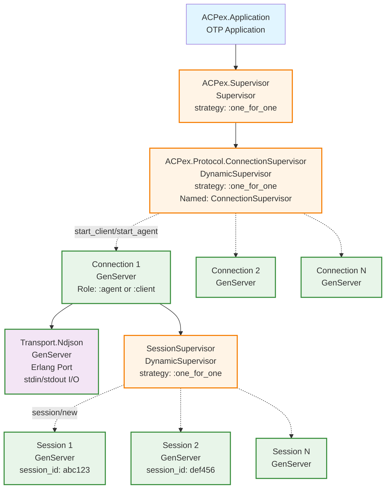
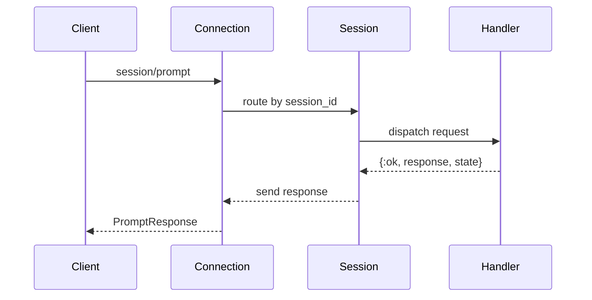
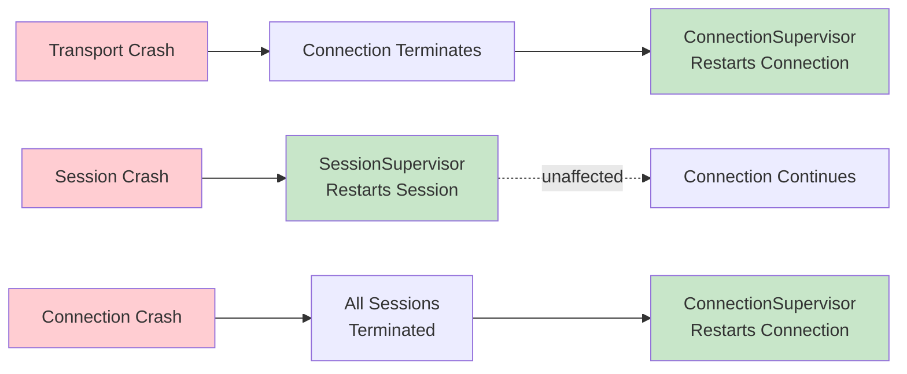
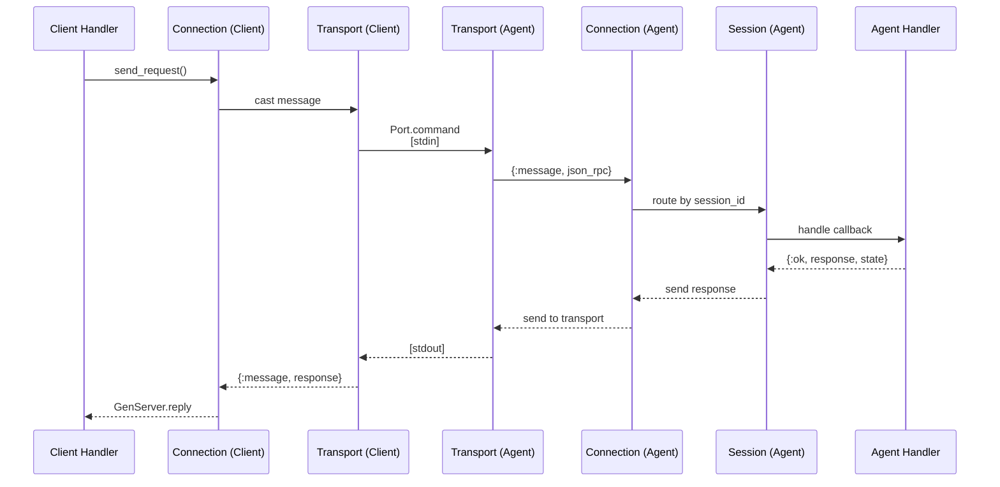
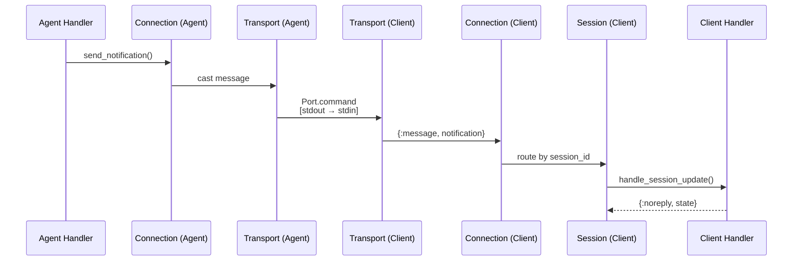

# Supervision Tree Architecture

This guide explains ACPex's OTP supervision tree, how it works, and how to
configure it in your application.

## Overview

ACPex is built on OTP principles with a multi-layered supervision tree that
provides fault tolerance, process isolation, and dynamic resource management.
The architecture ensures that crashes are isolated and don't bring down the
entire system.

## Complete Supervision Tree



## Core Components

### ACPex.Application

- **Type**: OTP Application
- **File**: `lib/acpex/application.ex`
- **Purpose**: Entry point for the ACPex application
- **Starts**: `ACPex.Supervisor`
- **Lifecycle**: Started automatically when ACPex is added as a dependency

```elixir
# Automatically started - no manual configuration needed
def deps do
  [{:acpex, "~> 0.1"}]
end
```

### ACPex.Supervisor

- **Type**: Supervisor
- **Strategy**: `:one_for_one`
- **Children**: `ConnectionSupervisor`
- **Behavior**: If `ConnectionSupervisor` crashes, it's restarted independently

### ConnectionSupervisor

- **Type**: DynamicSupervisor
- **Strategy**: `:one_for_one`
- **Named**: Yes (`ConnectionSupervisor`)
- **Purpose**: Manages all active connections (agents and clients)
- **Isolation**: Each connection is isolated; a crash in one doesn't affect
  others

**Key Functions**:

```elixir
# Start a new connection under this supervisor
ConnectionSupervisor.start_connection(
  handler_module: MyAgent,
  handler_args: [],
  role: :agent,
  opts: [name: :my_agent]
)
```

### Connection (GenServer)

- **Type**: GenServer
- **Per**: Connection (agent or client)
- **State**:
  - Handler module and state
  - Role (`:agent` or `:client`)
  - Transport PID
  - Session supervisor PID
  - Sessions map (`%{session_id => pid}`)
  - Pending requests (for response correlation)

**Responsibilities**:

- Handle connection-level messages (`initialize`, `authenticate`)
- Route session-level messages to appropriate Session process
- Manage bidirectional JSON-RPC communication
- Track pending requests and match responses

**Process Hierarchy**: Each Connection spawns:

1. **Transport.Ndjson** GenServer (for I/O)
2. **SessionSupervisor** (for managing sessions)

### SessionSupervisor

- **Type**: DynamicSupervisor
- **Strategy**: `:one_for_one`
- **Per**: Connection
- **Purpose**: Dynamically create and manage session processes
- **Isolation**: Session crashes don't affect other sessions or the connection

### Session (GenServer)

- **Type**: GenServer
- **Per**: Conversation session
- **State**:
  - Handler module and state
  - Unique `session_id`
  - Connection PID
  - Transport PID

**Responsibilities**:

- Handle session-level messages (`session/prompt`, `session/cancel`)
- Route filesystem requests (`fs/read_text_file`, `fs/write_text_file`)
- Route terminal requests (`terminal/*`)
- Maintain conversation state

### Transport.Ndjson (GenServer)

- **Type**: GenServer
- **Per**: Connection
- **Purpose**: Handle newline-delimited JSON communication over stdio
- **Technology**: Erlang Ports for external process management

**Features**:

- Line-buffered I/O for automatic message framing
- Non-blocking asynchronous message passing
- Automatic cleanup on termination
- Bidirectional communication

## Process Lifecycle

### Starting an Agent

```elixir
{:ok, conn_pid} = ACPex.start_agent(MyAgent, [])
```

**What Happens**:

1. `ACPex.start_agent/3` calls `ConnectionSupervisor.start_connection/1`
2. `ConnectionSupervisor` starts a `Connection` process with `role: :agent`
3. `Connection.init/1`:
   - Calls `MyAgent.init/1` to get initial handler state
   - Starts `Transport.Ndjson` (listening on stdin/stdout)
   - Starts `SessionSupervisor`
4. Connection is ready - waits for client to send `initialize`

### Starting a Client

```elixir
{:ok, conn_pid} = ACPex.start_client(
  MyClient,
  [],
  agent_path: "/path/to/agent",
  agent_args: []
)
```

**What Happens**:

1. `ACPex.start_client/3` calls `ConnectionSupervisor.start_connection/1`
2. `ConnectionSupervisor` starts a `Connection` process with `role: :client`
3. `Connection.init/1`:
   - Calls `MyClient.init/1` to get initial handler state
   - Starts `Transport.Ndjson` with agent as subprocess
   - Starts `SessionSupervisor`
4. Connection is ready - client sends `initialize` to agent

### Creating a Session

When the client sends `session/new`:

1. Connection receives message
2. Connection calls handler's `handle_new_session/2`
3. Handler returns `{:ok, response, state}` with `session_id`
4. Connection calls `SessionSupervisor.start_session/5`
5. SessionSupervisor spawns new Session GenServer
6. Session registers itself with Connection
7. Connection maps `session_id -> session_pid`

### Session Message Flow



## Supervision Strategies

### One-for-One Strategy

All supervisors use `:one_for_one`:

- **ConnectionSupervisor**: If Connection A crashes, only A is restarted.
  Connection B unaffected.
- **SessionSupervisor**: If Session 1 crashes, only Session 1 is restarted.
  Session 2 unaffected.

### Fault Isolation Levels

**Level 1 - Application**:

- If `ConnectionSupervisor` crashes, entire tree restarts
- Rare, only on critical bugs

**Level 2 - Connection**:

- If a `Connection` crashes, only that connection restarts
- Sessions under it are terminated
- Other connections unaffected

**Level 3 - Session**:

- If a `Session` crashes, only that session restarts
- Other sessions in same connection unaffected
- Connection remains stable

**Level 4 - Transport**:

- If `Transport` crashes, parent Connection is notified
- Connection typically terminates (no I/O available)
- Supervisor restarts the Connection

### Crash Propagation



## Integration Patterns

### Pattern 1: Default (Recommended)

Let ACPex manage its own supervision tree:

```elixir
# mix.exs
def deps do
  [{:acpex, "~> 0.1"}]
end

# Your application
defmodule MyApp.Application do
  use Application

  def start(_type, _args) do
    children = [
      # Your app's processes
      MyApp.Repo,
      MyAppWeb.Endpoint
    ]

    opts = [strategy: :one_for_one, name: MyApp.Supervisor]
    Supervisor.start_link(children, opts)
  end
end

# Start connections when needed
{:ok, agent_pid} = ACPex.start_agent(MyAgent, [])
{:ok, client_pid} = ACPex.start_client(MyClient, [], agent_path: "/path/to/agent")
```

**Pros**:

- Simple setup
- ACPex handles fault tolerance
- Connections can be started dynamically

**Cons**:

- Less control over lifecycle
- Connections not automatically restarted on app restart

### Pattern 2: Custom Supervision

Embed connections in your app's supervision tree:

```elixir
defmodule MyApp.Application do
  use Application

  def start(_type, _args) do
    children = [
      MyApp.Repo,
      # Add ACPex connections as children
      {ACPex.Protocol.Connection,
       handler_module: MyApp.Agent,
       handler_args: [],
       role: :agent,
       opts: [name: MyApp.Agent]},
      MyAppWeb.Endpoint
    ]

    opts = [strategy: :one_for_one, name: MyApp.Supervisor]
    Supervisor.start_link(children, opts)
  end
end
```

**Pros**:

- Full control over process lifecycle
- Agent/client restarts with your app
- Can use named processes

**Cons**:

- Must manage supervision manually
- Less dynamic (connections defined at compile time)

### Pattern 3: Multiple Connections

Run multiple agents or clients simultaneously:

```elixir
defmodule MyApp.Application do
  use Application

  def start(_type, _args) do
    children = [
      # Agent 1 - Code assistant
      {ACPex.Protocol.Connection,
       handler_module: MyApp.CodeAssistant,
       handler_args: [],
       role: :agent,
       opts: [name: MyApp.CodeAssistant]},

      # Agent 2 - Documentation writer
      {ACPex.Protocol.Connection,
       handler_module: MyApp.DocWriter,
       handler_args: [],
       role: :agent,
       opts: [name: MyApp.DocWriter]},

      # Client - connects to external agent
      {ACPex.Protocol.Connection,
       handler_module: MyApp.EditorClient,
       handler_args: [],
       role: :client,
       opts: [
         name: MyApp.EditorClient,
         agent_path: "/usr/bin/claude-code-acp"
       ]}
    ]

    opts = [strategy: :one_for_one, name: MyApp.Supervisor]
    Supervisor.start_link(children, opts)
  end
end
```

## Configuration Options

### Application-Level

```elixir
# config/config.exs
# Currently no application-level config needed
# All configuration is per-connection
```

### Connection Options

When starting a connection:

```elixir
ACPex.start_agent(
  MyAgent,                    # handler_module
  [custom: :args],            # handler_args (passed to init/1)
  name: MyAgent.Connection    # optional: register with name
)

ACPex.start_client(
  MyClient,                   # handler_module
  [custom: :args],            # handler_args
  agent_path: "/path/to/exe", # required for clients
  agent_args: ["--flag"],     # optional: agent CLI args
  name: MyClient.Connection   # optional: register with name
)
```

### Named Processes

Use names for easy access:

```elixir
# Start with name
{:ok, _pid} = ACPex.start_agent(MyAgent, [], name: :my_agent)

# Send messages using name
ACPex.Protocol.Connection.send_notification(
  :my_agent,
  "session/update",
  %{...}
)
```

## Process Communication

### Message Flow Patterns

**Pattern 1: Client → Agent (Request)**



**Pattern 2: Agent → Client (Notification)**



### Request/Response Correlation

Connection tracks pending requests:

```elixir
# State in Connection
%{
  pending_requests: %{
    1 => {from_pid, from_ref},  # Request ID 1
    2 => {from_pid, from_ref}   # Request ID 2
  },
  next_id: 3
}
```

When response arrives:

1. Extract `id` from JSON-RPC response
2. Lookup `from` in `pending_requests`
3. Reply to caller with `GenServer.reply(from, result)`
4. Remove from `pending_requests`

## Debugging the Tree

### Inspect Running Processes

```elixir
# List all connections
DynamicSupervisor.which_children(ACPex.Protocol.ConnectionSupervisor)

# Get connection info
{:ok, conn_pid} = ACPex.start_agent(MyAgent, [], name: :my_agent)
:sys.get_state(:my_agent)

# List sessions for a connection
# (Access connection's state to see sessions map)
```

### Process Tree Visualization

```elixir
# In IEx
:observer.start()
# Navigate to Applications tab → acpex
```

### Logging

Enable debug logging:

```elixir
# config/config.exs
config :logger, level: :debug
```

ACPex logs:

- Connection lifecycle events
- Session creation/termination
- Message send/receive (truncated)
- Transport port operations

## Best Practices

### 1. Use Named Processes Sparingly

Only name processes that need global access:

```elixir
# Good: Named for global access
{:ok, _} = ACPex.start_agent(MyAgent, [], name: MyApp.MainAgent)

# Avoid: Unnamed connections are fine if you keep the PID
{:ok, pid} = ACPex.start_agent(MyAgent, [])
# Store pid in your app's state
```

### 2. Handle Process Termination

Monitor connection processes:

```elixir
{:ok, pid} = ACPex.start_agent(MyAgent, [])
Process.monitor(pid)

# In your GenServer
def handle_info({:DOWN, _ref, :process, pid, reason}, state) do
  Logger.warning("Agent connection terminated: #{inspect(reason)}")
  # Restart or alert
  {:noreply, state}
end
```

### 3. Session Cleanup

Sessions are automatically terminated when:

- Parent connection terminates
- Session process crashes (supervisor may restart)
- Application shuts down

No manual cleanup needed.

### 4. Resource Limits

DynamicSupervisor has no child limit by default. Consider:

```elixir
# In your app, limit connections if needed
def start_agent(module, args) do
  case count_connections() do
    n when n < 10 ->
      ACPex.start_agent(module, args)
    _ ->
      {:error, :too_many_connections}
  end
end
```

### 5. Testing

Test with supervision:

```elixir
# test/my_agent_test.exs
test "agent handles crashes gracefully" do
  {:ok, pid} = ACPex.start_agent(MyAgent, [])

  # Kill a session
  session_pids = get_session_pids(pid)
  Process.exit(hd(session_pids), :kill)

  # Connection should still work
  assert Process.alive?(pid)
end
```

## Troubleshooting

### Connection Crashes Immediately

**Symptom**: Connection process terminates right after start

**Causes**:

- Handler's `init/1` returns `{:error, reason}`
- Transport fails to start (invalid `agent_path` for clients)
- Agent executable crashes immediately

**Solution**:

```elixir
# Check handler init
def init(args) do
  # Add logging
  Logger.info("Handler initializing with args: #{inspect(args)}")
  {:ok, %{}}
end

# Verify agent path
System.find_executable("your-agent")
```

### Sessions Not Receiving Messages

**Symptom**: Messages sent but handler not called

**Cause**: Session not registered with Connection

**Solution**: Check that session ID matches between request and session

### Transport Errors

**Symptom**: `Port terminated` errors

**Causes**:

- Agent executable not found
- Agent crashes
- Agent writes invalid JSON

**Solution**: Test agent standalone first:

```bash
echo '{"jsonrpc":"2.0","id":1,"method":"initialize","params":{}}' | your-agent
```

## Summary

ACPex's supervision tree provides:

- **Fault Tolerance**: Crashes isolated at connection and session levels
- **Scalability**: Dynamic supervisors for unlimited connections/sessions
- **Simplicity**: Automatic startup, minimal configuration
- **Flexibility**: Embed in your app or use standalone

For most applications, the default configuration (Pattern 1) is sufficient. Use
custom supervision (Pattern 2) when you need fine-grained control over process
lifecycle and restart behavior.

<script defer src="https://cdn.jsdelivr.net/npm/mermaid@10.2.3/dist/mermaid.min.js"></script>
<script>
  let initialized = false;

  window.addEventListener("exdoc:loaded", () => {
    if (!initialized) {
      mermaid.initialize({
        startOnLoad: false,
        theme: document.body.className.includes("dark") ? "dark" : "default"
      });
      initialized = true;
    }

    let id = 0;
    for (const codeEl of document.querySelectorAll("pre code.mermaid")) {
      const preEl = codeEl.parentElement;
      const graphDefinition = codeEl.textContent;
      const graphEl = document.createElement("div");
      const graphId = "mermaid-graph-" + id++;
      mermaid.render(graphId, graphDefinition).then(({svg, bindFunctions}) => {
        graphEl.innerHTML = svg;
        bindFunctions?.(graphEl);
        preEl.insertAdjacentElement("afterend", graphEl);
        preEl.remove();
      });
    }
  });
</script>
